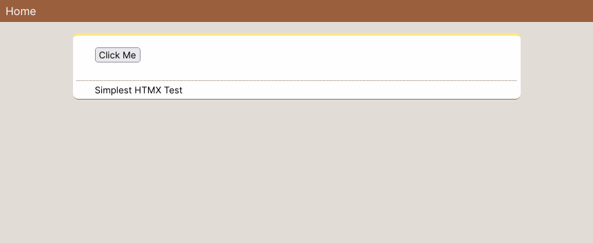

# HTMX PHP Sandbox

This is just a minimal setup for PHP developers to get started playing with HTMX.

* Basic HTML layout with libraries loaded.
* Enough styles to get something on screen.
* HTMX example.

## Setup

Checkout a copy of this repo, run the builtin webserver:

```shell
git clone https://github.com/svandragt/htmx-php-sandbox && cd htmx-php-sandbox && rm -rf .git
php -S localhost:5000 -t src
```

Happy hacking!



